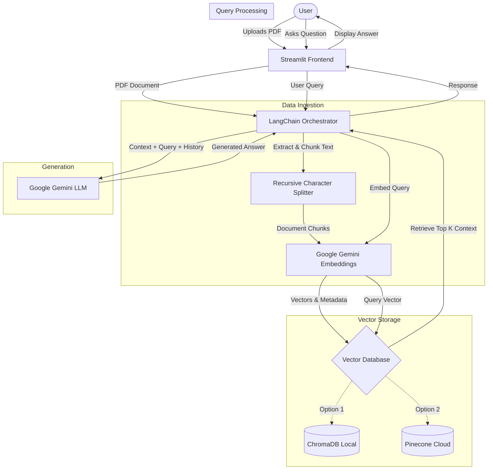

# RAG Chatbot

This project is a Retrieval-Augmented Generation (RAG) chatbot application. It allows users to upload PDF documents and engage in a conversational Q&A with an AI assistant that references the uploaded content to provide accurate and context-aware answers.

## System Design

The application is built using a modern AI tech stack, integrating a user-friendly frontend with a robust retrieval and generation backend.

### Flowchart



### Architecture Components

1. **Frontend Interface (Streamlit)**
   - Built entirely in Python using Streamlit.
   - Provides a responsive and interactive chat interface.
   - Handles file uploads (PDFs) and user configuration (API keys, Vector Database selection).
   - Manages session state to preserve chat history and loaded vector stores across re-runs.

2. **Orchestration (LangChain)**
   - Acts as the core framework connecting the various AI components.
   - Manages document loading, text splitting, and the Conversational Retrieval Chain.
   - Maintains memory of the conversation context so follow-up questions are handled naturally.

3. **Language Model & Embeddings (Google Gemini)**
   - **Embeddings:** Uses Google Generative AI Embeddings (`models/embedding-001`) to convert document chunks into high-dimensional vector representations.
   - **LLM:** Uses the `gemini-3-flash-preview` model for fast and accurate generation of responses based on the retrieved context.

4. **Vector Database Storage**
   - The application supports two distinct storage mechanisms for document vectors:
   - **Chroma (Local):** An ephemeral, on-disk vector database suitable for quick, localized testing and smaller documents without requiring external infrastructure.
   - **Pinecone (Cloud):** A managed, cloud-native vector database designed for persistence, scalability, and production workloads.

### Data Flow

1. **Ingestion:** The user uploads a PDF document.
2. **Processing:** The PDF is parsed, its text is extracted, and the text is split into smaller, overlapping chunks (using a Recursive Character Text Splitter).
3. **Embedding:** Each chunk is passed to the Gemini Embedding model to generate vector representations.
4. **Storage:** The vectors and their corresponding text metadata are stored in either Chroma or Pinecone, depending on user selection.
5. **Retrieval:** When a user asks a question, the question is also embedded and used to query the vector database for the most semantically similar chunks.
6. **Generation:** The retrieved chunks (context) and the chat history are fed into the Gemini LLM, which synthesizes a coherent and accurate response.

## Setup and Installation

1. Create a Python virtual environment and activate it.
2. Install the required dependencies:
   ```bash
   pip install -r requirements.txt
   ```
3. Set up your environment variables. Create a `.env` file in the root directory and add your API keys:
   ```env
   GOOGLE_API_KEY="your_google_gemini_api_key"
   PINECONE_API_KEY="your_pinecone_api_key"
   PINECONE_INDEX_NAME="your_pinecone_index_name"
   ```

## Usage

Run the Streamlit application locally:
```bash
streamlit run app.py
```

You can optionally provide your Google Gemini API key directly through the application's sidebar interface if it is not set in the environment variables.

## Key Features

- **Document Understanding:** Extract insights from any uploaded PDF.
- **Conversational Memory:** The assistant remembers previous questions and context within the session.
- **Flexible Storage:** Switch seamlessly between local storage (Chroma) and cloud storage (Pinecone).
- **Graceful Error Handling:** Explicit validation for missing API keys and proper handling of API authentication edge cases.
